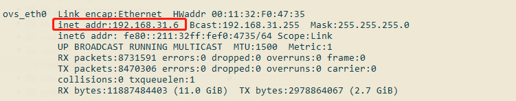
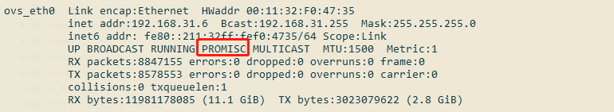
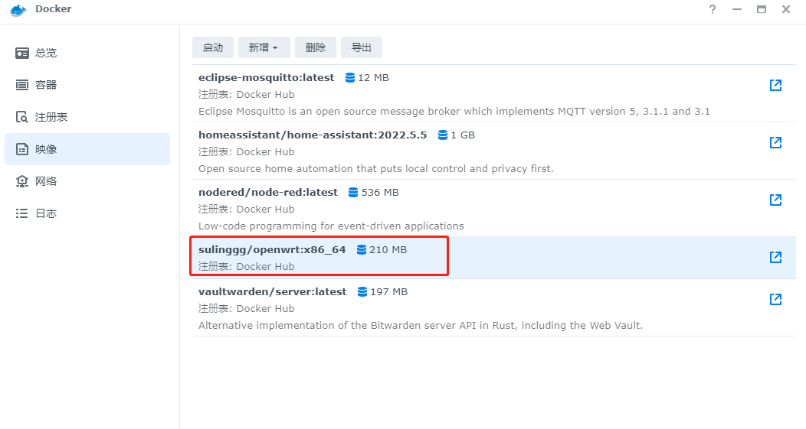
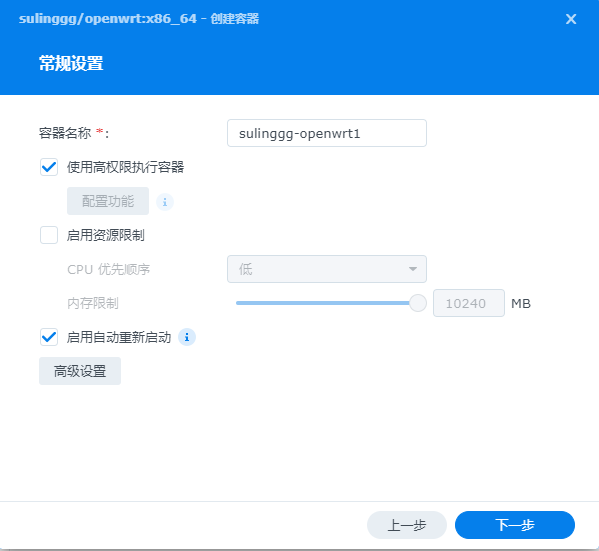
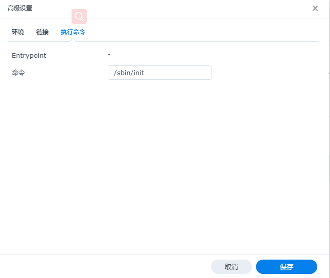
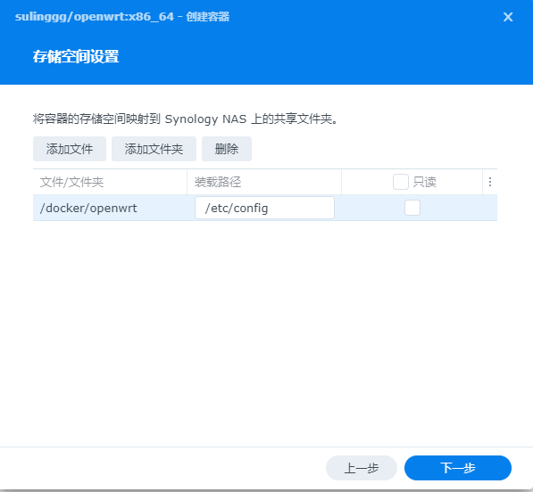
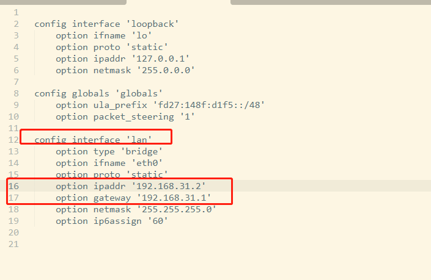

# 开始混杂模式

>**网卡工作模式**  
1. 广播模式：物理地址（MAC）是0Xffffff的帧为广播帧，工作在广播模式的网卡接收广播帧。  
2. 多播模式：如果将网卡设置为多播模式，它可以接收所有的多播传送帧，而不论他是不是组内成员。  
3. 直接模式：只接收目的地址是自己MAC地址的帧。  
4. 混杂模式：工作在混杂模式下的网卡接收所有流经网卡的帧。  
网卡默认工作模式包括广播模式和直接模式，即它只接收广播帧和发给自己的帧。如果采用混杂模式，一个站点的网卡将接收同一网络内所有站点所发送的数据包，这样就可以达到对网络信息监视捕获的目的。

```bash
# 查看网卡状态，有IP地址的就是我们的网卡
ifconfig
# 开启混杂模式(请替换`ovs_eth0`为自己的网卡)
sudo ip link set ovs_eth0 promisc on
```



# 创建docker网卡
```bash
# 替换`ovs_eth0`为自己的网卡(macvlan 模式会为每个容器创建一个独立的 ip 每个容器可以通过独立的 ip 进行访问)
sudo docker network create -d macvlan --subnet=192.168.31.6/24 --gateway=192.168.31.1 -o parent=ovs_eth0 macnet
```

# 创建容器
1. 下载镜像  

2. 权限  


3. 设置  

4. 调整配置  


# 端口转发（暂不使用）
```bash
# 9090 端口转发到 80
iptables -t nat -A PREROUTING --dst 192.168.31.6 -p tcp --dport 9090 -j DNAT --to-destination 192.168.31.7:80
# 返回
iptables -t nat -A POSTROUTING --dst 192.168.31.7 -p tcp --dport 80 -j SNAT --to-source 192.168.31.6
```

# 启动后如果能ping IP，但不能ping网址，请先设置DNS
